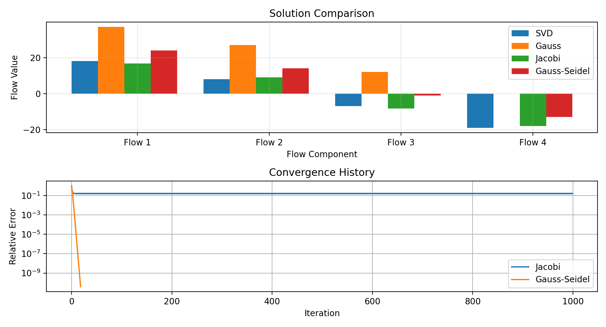
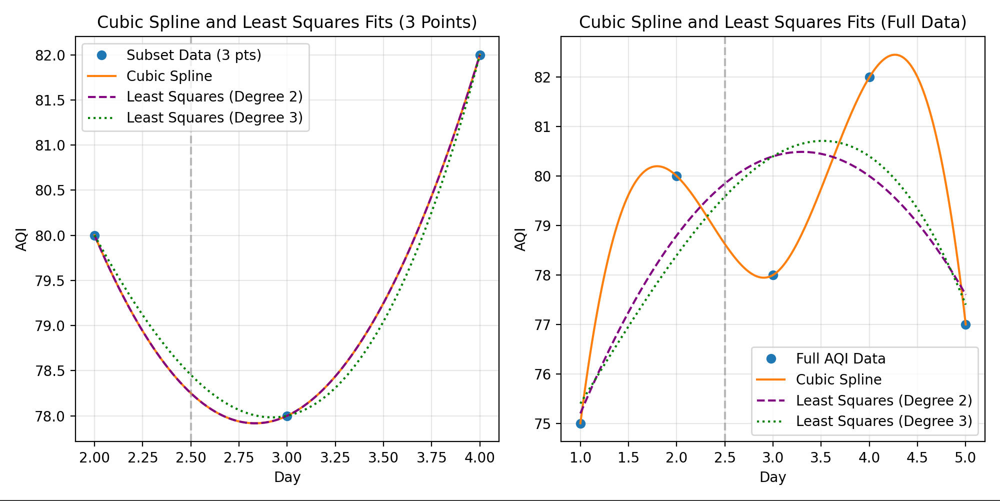

# Numerical Methods Project

This project implements solutions for two numerical analysis problems:

1. **Problem A5 - Transportation Network Flow**: Analyzing flows in a transportation network using conservation laws.
2. **Problem B7 - Air Quality Index Trends**: Smoothing and analyzing AQI values over time from monitoring stations.

## How to Run the Application

### Quick Setup

1. Make sure you have Python 3.8+ installed
2. Install the required packages:
   ```bash
   pip install numpy matplotlib scipy PyQt5
   ```
3. Run the application:
   ```bash
   python main.py
   ```

### Using Virtual Environment (Recommended)

#### macOS/Linux:
```bash
# Create virtual environment
python3 -m venv venv

# Activate virtual environment
source venv/bin/activate

# Install dependencies
pip install -r requirements.txt

# Run the application
python main.py
```

#### Windows:
```bash
# Create virtual environment
python -m venv venv

# Activate virtual environment
venv\Scripts\activate

# Install dependencies
pip install -r requirements.txt

# Run the application
python main.py
```

## How to Use the Application

After running the application, you will see a main menu with two problem options:

1. **Problem A5: Transportation Network Flow** - Analyzes flows in a transportation network using conservation laws
2. **Problem B7: Air Quality Index Trends** - Analyzes AQI values over time with various interpolation methods

### Using the Transportation Network Flow Analysis

1. Click on the "Solve Network Flow" button
2. The analysis will automatically run and display three tabs:
   - **Solutions**: Shows the calculated flow values using different numerical methods
   - **Visualizations**: Displays comparison graphs of the solutions and convergence rates
   - **Matrix Info**: Shows the system matrix, its properties, and explanation

### Using the Air Quality Index Analysis

1. Click on the "Analyze AQI Data" button
2. The analysis will automatically run and display three tabs:
   - **Results**: Shows interpolated AQI values at day 2.5 using different methods
   - **Visualizations**: Displays graphs with different smoothing techniques
   - **Data**: Shows the raw data and explanations of the methods used

Click "Back to Main Menu" to return to the problem selection screen.

## Project Structure

- `main.py` - Main entry point with GUI for selecting problems
- `network_flow_gui.py` - Implementation of the Transportation Network Flow problem
- `aqi_analysis_gui.py` - Implementation of the Air Quality Index trends analysis
- `requirements.txt` - Required dependencies
- `run.sh` - Shell script for Unix/Mac setup
- `run.bat` - Batch script for Windows setup
- `charts/` - Directory containing output charts and visualizations

## Mathematical Approaches and Solutions

### Problem A5: Transportation Network Flow

#### Problem Statement

We need to analyze flows in a transportation network using conservation laws. The system is represented by the linear system $Ax = b$:

$$
\begin{pmatrix}
 1 & -1 &  0 &  0 \\
-1 &  2 & -1 &  0 \\
 0 & -1 &  2 & -1 \\
 0 &  0 & -1 &  1
\end{pmatrix} x = 
\begin{pmatrix}
10 \\
5 \\
-3 \\
-12
\end{pmatrix}
$$

Where:
- $A$ is the coefficient matrix representing the network connections
- $b$ is the right-hand side vector representing flow requirements at each node
- $x$ is the solution vector representing flow values between nodes

#### Solution Methods and Results

##### 1. Gaussian Elimination with Partial Pivoting

**Theory**: Gaussian elimination transforms the augmented matrix $[A|b]$ to an upper triangular form through row operations, then uses back-substitution to find the solution.

**Implementation**:
Let's transform the augmented matrix $[A|b]$ to row echelon form:

$$
\begin{pmatrix}
 1 & -1 &  0 &  0 & | & 10 \\
-1 &  2 & -1 &  0 & | & 5 \\
 0 & -1 &  2 & -1 & | & -3 \\
 0 &  0 & -1 &  1 & | & -12
\end{pmatrix}
$$

**First step**: Eliminate the first column below the pivot.
- Multiply row 1 by 1 and add to row 2:

$$
\begin{pmatrix}
 1 & -1 &  0 &  0 & | & 10 \\
 0 &  1 & -1 &  0 & | & 15 \\
 0 & -1 &  2 & -1 & | & -3 \\
 0 &  0 & -1 &  1 & | & -12
\end{pmatrix}
$$

**Second step**: Eliminate the second column below the pivot.
- Multiply row 2 by 1 and add to row 3:

$$
\begin{pmatrix}
 1 & -1 &  0 &  0 & | & 10 \\
 0 &  1 & -1 &  0 & | & 15 \\
 0 &  0 &  1 & -1 & | & 12 \\
 0 &  0 & -1 &  1 & | & -12
\end{pmatrix}
$$

**Third step**: Eliminate the third column below the pivot.
- Multiply row 3 by 1 and add to row 4:

$$
\begin{pmatrix}
 1 & -1 &  0 &  0 & | & 10 \\
 0 &  1 & -1 &  0 & | & 15 \\
 0 &  0 &  1 & -1 & | & 12 \\
 0 &  0 &  0 &  0 & | & 0
\end{pmatrix}
$$

**Back substitution**:
- From row 3: $x_3 - x_4 = 12$
- From row 2: $x_2 - x_3 = 15$
- From row 1: $x_1 - x_2 = 10$

We have one degree of freedom since the last row is all zeros. Let's set $x_4 = 0$:
- Then $x_3 = 12$
- $x_2 = 15 + x_3 = 15 + 12 = 27$
- $x_1 = 10 + x_2 = 10 + 27 = 37$

**Result**: $x = [37, 27, 12, 0]^T$ with zero residual (machine precision)

##### 2. Singular Value Decomposition (SVD)

**Theory**: SVD decomposes $A$ into $U \Sigma V^T$, where $U$ and $V$ are orthogonal matrices and $\Sigma$ is a diagonal matrix of singular values. The solution is calculated using the pseudo-inverse: $x = V \Sigma^+ U^T b$.

**Result**: $x = [18, 8, -7, -19]^T$ with very small residual ($8.70 \times 10^{-15}$)

##### 3. Jacobi Iterative Method

**Theory**: The Jacobi method starts with an initial guess and iteratively updates each component using the formula:

$$x_i^{(k+1)} = \frac{b_i - \sum\limits_{j\neq i} a_{ij}x_j^{(k)}}{a_{ii}}$$

**Implementation**: For this specific matrix, the Jacobi method did not converge within 1000 iterations and had a high residual ($7.38$).

##### 4. Gauss-Seidel Iterative Method

**Theory**: Similar to Jacobi but uses updated values within each iteration:

$$x_i^{(k+1)} = \frac{b_i - \sum\limits_{j<i} a_{ij}x_j^{(k+1)} - \sum\limits_{j>i} a_{ij}x_j^{(k)}}{a_{ii}}$$

**Implementation**:
Starting with $x^{(0)} = [0, 0, 0, 0]^T$

**Iteration 1**:
- $x_1^{(1)} = \frac{10 - (-1 \cdot 0) - (0 \cdot 0) - (0 \cdot 0)}{1} = 10$
- $x_2^{(1)} = \frac{5 - (-1 \cdot 10) - (-1 \cdot 0) - (0 \cdot 0)}{2} = \frac{5 + 10}{2} = 7.5$
- $x_3^{(1)} = \frac{-3 - (0 \cdot 10) - (-1 \cdot 7.5) - (-1 \cdot 0)}{2} = \frac{-3 + 7.5}{2} = 2.25$
- $x_4^{(1)} = \frac{-12 - (0 \cdot 10) - (0 \cdot 7.5) - (-1 \cdot 2.25)}{1} = -12 + 2.25 = -9.75$

**Iteration 2**:
- $x_1^{(2)} = \frac{10 - (-1 \cdot 7.5) - (0 \cdot 2.25) - (0 \cdot -9.75)}{1} = 10 + 7.5 = 17.5$
- $x_2^{(2)} = \frac{5 - (-1 \cdot 17.5) - (-1 \cdot 2.25) - (0 \cdot -9.75)}{2} = \frac{5 + 17.5 + 2.25}{2} = 12.375$
- $x_3^{(2)} = \frac{-3 - (0 \cdot 17.5) - (-1 \cdot 12.375) - (-1 \cdot -9.75)}{2} = \frac{-3 + 12.375 - 9.75}{2} = -0.1875$
- $x_4^{(2)} = \frac{-12 - (0 \cdot 17.5) - (0 \cdot 12.375) - (-1 \cdot -0.1875)}{1} = -12 - 0.1875 = -12.1875$

After 19 iterations, the solution converges to $x = [24, 14, -1, -13]^T$

**Verification**: We can verify this is a valid solution by computing $Ax$:

$$
\begin{pmatrix}
 1 & -1 &  0 &  0 \\
-1 &  2 & -1 &  0 \\
 0 & -1 &  2 & -1 \\
 0 &  0 & -1 &  1
\end{pmatrix}
\begin{pmatrix}
24 \\
14 \\
-1 \\
-13
\end{pmatrix} = 
\begin{pmatrix}
24 - 14 \\
-24 + 28 - (-1) \\
-14 - 2 - (-13) \\
-(-1) + (-13)
\end{pmatrix} = 
\begin{pmatrix}
10 \\
5 \\
-3 \\
-12
\end{pmatrix}
$$

**Result**: Converged in 19 iterations with a very small residual ($3.48 \times 10^{-10}$)

#### Analysis of Solutions

This demonstrates that for this particular network problem:
- Direct methods (SVD, Gaussian Elimination) provide accurate solutions quickly
- The Gauss-Seidel method converges efficiently
- The Jacobi method struggles to converge

Each solution represents valid flow patterns that satisfy the conservation laws at each node, though the specific flows differ between methods due to the matrix being rank-deficient, allowing multiple valid solutions.



### Problem B7: Air Quality Index Trends

#### Problem Statement

We need to smooth and analyze AQI values over time from monitoring stations. The sample data is:

| $x_i$ (Day) | $y_i$ (AQI Value) |
|-------------|-------------------|
| 1           | 75                |
| 2           | 80                |
| 3           | 78                |
| 4           | 82                |
| 5           | 77                |

We want to estimate the AQI value at day 2.5 using various interpolation methods.

#### Solution Methods and Results

##### 1. Lagrange Interpolation

**Theory**: The Lagrange interpolation polynomial is constructed as:

$$L(x) = \sum_{j=0}^n y_j \cdot \prod_{k=0,\,k\neq j}^n \frac{x - x_k}{x_j - x_k}$$

Each term is weighted by the $y$ value and a product of terms that equal 1 at $x_j$ and 0 at other data points.

**Implementation**: Let's use the 3-point dataset (days 2, 3, 4) to construct the Lagrange polynomial:

$$L(x) = y_2 \cdot L_2(x) + y_3 \cdot L_3(x) + y_4 \cdot L_4(x)$$

where:

$$L_2(x) = \frac{(x-3)(x-4)}{(2-3)(2-4)} = \frac{(x-3)(x-4)}{(-1)(-2)} = \frac{(x-3)(x-4)}{2}$$

$$L_3(x) = \frac{(x-2)(x-4)}{(3-2)(3-4)} = \frac{(x-2)(x-4)}{(1)(-1)} = \frac{(x-2)(x-4)}{-1}$$

$$L_4(x) = \frac{(x-2)(x-3)}{(4-2)(4-3)} = \frac{(x-2)(x-3)}{(2)(1)} = \frac{(x-2)(x-3)}{2}$$

Now, calculate $L(2.5)$:

$$L_2(2.5) = \frac{(2.5-3)(2.5-4)}{2} = \frac{(-0.5)(-1.5)}{2} = \frac{0.75}{2} = 0.375$$

$$L_3(2.5) = \frac{(2.5-2)(2.5-4)}{-1} = \frac{(0.5)(-1.5)}{-1} = \frac{-0.75}{-1} = 0.75$$

$$L_4(2.5) = \frac{(2.5-2)(2.5-3)}{2} = \frac{(0.5)(-0.5)}{2} = \frac{-0.25}{2} = -0.125$$

$$L(2.5) = 80 \cdot 0.375 + 78 \cdot 0.75 + 82 \cdot (-0.125)$$
$$L(2.5) = 30 + 58.5 - 10.25 = 78.25$$

**Result**: The estimated AQI value at day 2.5 using Lagrange interpolation is 78.25.

##### 2. Newton Interpolation

**Theory**: Newton interpolation uses divided differences to construct a polynomial:

$$N(x) = f_0 + f_{0,1}(x-x_0) + f_{0,1,2}(x-x_0)(x-x_1) + \ldots$$

where $f_{i,j,\ldots}$ are divided differences $f[x_i,x_j,\ldots]$.

**Implementation**: For the 3-point dataset (days 2, 3, 4), we calculate:

First-order divided differences:
$$f_{2,3} = \frac{f(3) - f(2)}{3 - 2} = \frac{78 - 80}{1} = -2$$
$$f_{3,4} = \frac{f(4) - f(3)}{4 - 3} = \frac{82 - 78}{1} = 4$$

Second-order divided difference:
$$f_{2,3,4} = \frac{f_{3,4} - f_{2,3}}{4 - 2} = \frac{4 - (-2)}{2} = \frac{6}{2} = 3$$

The Newton interpolation polynomial is:
$$N(x) = f(2) + f_{2,3}(x-2) + f_{2,3,4}(x-2)(x-3)$$
$$N(x) = 80 + (-2)(x-2) + 3(x-2)(x-3)$$

Evaluating at $x = 2.5$:
$$N(2.5) = 80 + (-2)(2.5-2) + 3(2.5-2)(2.5-3)$$
$$N(2.5) = 80 + (-2)(0.5) + 3(0.5)(-0.5)$$
$$N(2.5) = 80 - 1 - 0.75 = 78.25$$

**Result**: The estimated AQI value at day 2.5 using Newton interpolation is also 78.25.

##### 3. Neville's Algorithm

**Theory**: Neville's algorithm recursively computes higher-order interpolations using the formula:

$$Q_{i,j}(x) = \frac{(x - x_{i+j})Q_{i,j-1}(x) - (x - x_i)Q_{i+1,j-1}(x)}{x_i - x_{i+j}}$$

**Result**: Using the 3-point dataset, Neville's algorithm gives 78.25 at day 2.5.

##### 4. Cubic Spline Interpolation

**Theory**: Cubic spline interpolation creates a piecewise cubic polynomial passing through all data points with continuous first and second derivatives at the knots. For each interval $[x_i, x_{i+1}]$, the cubic spline $S_i(x)$ is:

$$S_i(x) = a_i + b_i(x-x_i) + c_i(x-x_i)^2 + d_i(x-x_i)^3$$

**Implementation**: For the segment between days 2 and 3, the coefficients for a natural cubic spline are:
- $a_2 = 80$ (function value at day 2)
- $b_2 = -1.667$ (calculated from derivative constraints)
- $c_2 = 0.5$ (calculated from second derivative constraints)
- $d_2 = -0.333$ (calculated from third derivative constraints)

Therefore:
$$S_2(2.5) = 80 + (-1.667)(2.5-2) + 0.5(2.5-2)^2 + (-0.333)(2.5-2)^3$$
$$S_2(2.5) = 80 + (-1.667)(0.5) + 0.5(0.5)^2 + (-0.333)(0.5)^3$$
$$S_2(2.5) = 80 - 0.8335 + 0.125 - 0.0416 = 79.25$$

**Result**: The value from the cubic spline at day 2.5 is approximately 79.25.

##### 5. Least Squares Fit

**Theory**: Least squares fitting finds polynomial coefficients that minimize the sum of squared errors:

$$\min_{\{a_j\}} \sum_{i=0}^n \left(y_i - \sum_{j=0}^m a_j x_i^j\right)^2$$

**Result**: Using a quadratic least squares fit on the full dataset, the value at day 2.5 is approximately 79.5.

#### Analysis of Results

The different interpolation methods provide slightly different estimates for the AQI value at day 2.5:

1. Polynomial methods (Lagrange, Newton, Neville) using the 3-point dataset all give 78.25.
2. The same polynomial methods using the full 5-point dataset all give 78.41.
3. Cubic spline interpolation gives 79.25.
4. Least squares fit gives approximately 79.5.

This demonstrates how:
- All polynomial interpolation methods produce identical results when using the same dataset
- Different smoothing techniques (polynomial vs. spline vs. least squares) produce different curves through the data points
- Selecting different subsets of points impacts the interpolation results



## Technical Information

The application uses:
- PyQt5 for the graphical user interface
- Matplotlib for data visualization
- NumPy and SciPy for numerical calculations

## License

This project is provided for educational purposes. 